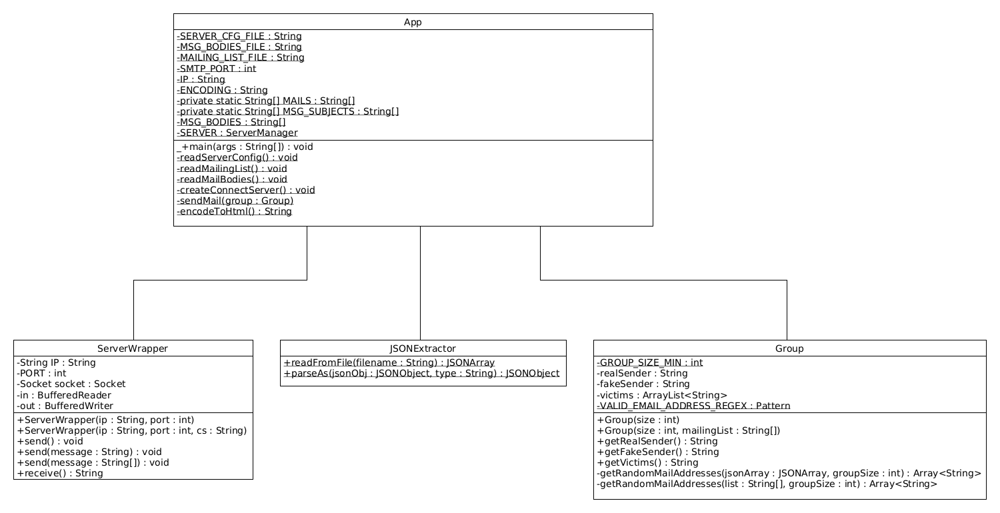

<!-- Your report MUST include the following sections:
* **A brief description of your project**: if people exploring GitHub find your repo, without a prior knowledge of the API course, they should be able to understand what your repo is all about and whether they should look at it more closely.
* **What is MockMock (or any other mock SMTP server you decided to use)?**
* **Instructions for setting up your mock SMTP server (with Docker - which you will learn all about in the next 2 weeks)**. The user who wants to experiment with your tool but does not really want to send pranks immediately should be able to use a mock SMTP server. For people who are not familiar with this concept, explain it to them in simple terms. Explain which mock server you have used and how you have set it up.
* **Clear and simple instructions for configuring your tool and running a prank campaign**. If you do a good job, an external user should be able to clone your repo, edit a couple of files and send a batch of e-mails in less than 10 minutes.
* **A description of your implementation**: document the key aspects of your code. It is a good idea to start with a **class diagram**. Decide which classes you want to show (focus on the important ones) and describe their responsibilities in text. It is also certainly a good idea to include examples of dialogues between your client and an SMTP server (maybe you also want to include some screenshots here).
-->

# DAI: Labo SMTP

## Brief

DAI (previously API and before RES) is a course about network programming at the HEIG-VD,
which stands for Internet Application Development (Développement d'Application Internet).

This lab will allow any user to:

- Send forged e-mails (in this case, containing jokes) to a list of victims, through the usage of a mock server
- Define the number of groups of victims that will receive the same e-mail
    - A group contains 1 sender and at least 2 recipients, so minimum size group is 3
- Define any message (joke) that can be sent to victims

## Details

This lab will make students develop a TCP client application in Java that send
a joke by email to a group of victims. The client application will use the Socket
API to communicate with a SMTP server.

The SMTP server will be set in place through a mock server
(using [MockMock](https://github.com/DominiqueComte/MockMock) repo). In this repo.,
the MockMock repository has been duplicated and can be found in the MockMock-docker folder.

For more details about the objectives and constraints concerning this lab, please refer to the [lab instructions](Donnee.md).

### Mock server

#### What is it?

A mock server is a server that simulates the behavior of an actual server.
For that matter, it is used during development to test, present the interface to clients and so on.

In our case, we will use it to test our client application without sending real e-mails.

#### Test it yourself with a Docker container

##### Docker presentation

Docker is a tool that allows an applications to be run in a container.
A container is a virtual environment that allows an application to run
isolated from the host machine, but sharing its resources.

##### Create the container

You need to be in the folder [MockMock-docker/](MockMock-docker/) (because of the Dockerfile being there)
and run the following command:

```bash
docker build --tag mockmock-docker .
```

Where you can enter something different to identify the image (here, mockmock-docker).

*Remark: Might need to run it as sudo/administrator.*

This will create a container named (tagged) `mockmock-docker` from the Dockerfile (rules to create a docker image).

This need to be done only once.

##### Run the container

To run the created container, you also need to be in the folder [MockMock-docker/](MockMock-docker/)
and run :

```bash
docker run -p 8080:8282 -p 2525:25000 --rm mockmock-docker
```

*Remarks: Might need to run it as sudo/administrator.*

This will run the container and expose the ports 8080 and 2525 on the host machine. 
You should now be able to access the MockMock server application by typing `localhost:8080` in any browser.

After closing the container (Ctrl+C), it will free resources properly. 

Just run that command again to use the mock server again.

### Client application usage

#### IDE

You can clone this repo., open the project and run it in your favorite IDE **:warning: while the mock server is running :warning:**.

<!-- Commented because not find a way to make it work properly yet
#### Command line

If you want to run it from the command line, you need some dependencies to be installed:

- [Maven](https://maven.apache.org/)
- [Java 8](https://www.oracle.com/technetwork/java/javase/downloads/jdk8-downloads-2133151.html)

Then, you can run the following command in the lab4/ folder of the project:

```bash
# Compile the project
mvn clean install

# Run the project
```
-->

#### Configuration files

The configuration files are located in the [config/](config/) folder.

They are in a JSON format and are used to configure multiple options for the client application.

##### Server's

[config/](configServer.json) contains the configuration for the server, like:

```json
{
    "config": {
        "ip": "localhost",    // IP address of the server
        "encoding": "UTF-8",  // Encoding used to send messages + for HTML format
        "portSMTP": 2525,     // Port used to connect to the server
        "portHTTP": 8080      // Not used in this application, but given by default
  }
}
```

[config/](config/mailBodies.json) contains the Subject and Bodies of a mail:

```json
{
    "mailBody": {
        "subject": "$ Cool ! LIFE HACKS ! 100 ACCURATE LIFE HACKS ! $",
        "body": "https://youtu.be/-h5WrWncDZw?t=220"
    }
},
```

The client choose randomly one of the mail content (both subject and body) in the list, during execution.

[config/](config/mailList.json) contains the mailing list. 
The sender and recipients are chosen randomly from the list.

The format is as followed:

```json
{
    {"mail":  { "address": "bobby.hermann@gmail.com" } },
    {"mail":  { "address": "considine.kelsie@hotmail.com" } },
    ...
}
```

### Client application

This is how the application is split:



[class diagram figure](figures/classDiagram.png)

The application works as followed:

1. The application reads the configuration files using the JSONExtractor class.
    * [Server's config](config/configServer.json)
    * [Mailing list](config/mailList.json)
    * [Mails bodies](config/mailBodies.json)
2. The user is asked to enter the number of groups of victims that will receive the same e-mail.
3. Groups are generated randomly from the mailing list (read in 1.) and using the Group class.
4. A socket is created and connected to the mock server (IP + port read in 1.) though a wrapper class (ServerWrapper).
5. For each group, the application sends a random mail from the list of mails bodies (read in 1.) to the group.
6. The application closes the server's socket and ends.

### Typical SMTP exchange

##### Dialog

The dialog for sending an SMTP message has to be like :

```text
Creating & Starting connection to mock server...
S: 220 af973c4743ed ESMTP MockMock SMTP Server version 1.4
-------------------------------------
C: HELO <company name>
S: 250 af973c4743ed
C: MAIL FROM:<sender>
S: 250 Ok
C: RCPT TO:<recepients>
S: 250 Ok
S: 250 Ok
C: DATA
<data>
<CRLF>.<CRLF>
S: 250 Ok
C: QUIT
S: 250 Ok
```

- **company name** : client or company address
- **sender** : e-mail address of the person sending the mail
- **recepients** : e-mail addresses of the recipients
- **data** : mail body

##### Message

A typical SMTP message the MockMock server would receive is as follows:

``` text
Received: from Dump ([172.17.0.1])
by f603b75c751c
with SMTP (MockMock SMTP Server version 1.4) id LB9TPJ74;
Sun, 04 Dec 2022 20:35:47 +0000 (UTC)
From: zreichel@moore.com
To: reinger.oswald@emmerich.com, brody.littel@dare.com, miles61@lang.net, laney.aufderhar@gmail.com, andreane58@hickle.info, hamill.brycen@lynch.biz, groberts@hotmail.com, cgraham@hotmail.com, keeling.geo@torp.biz, kunde.agustin@schmitt.info, krajcik.henry@hotmail.com, mcarter@langworth.info, domingo72@hotmail.com, deron37@yahoo.com, marquardt.felix@gmail.com, npfannerstill@hotmail.com, jacey65@macejkovic.org, mwolf@breitenberg.com, dorian.morar@gmail.com, kkunde@rodriguez.com, bbarrows@hotmail.com, chadd42@gmail.com, dominique.wolff@yahoo.com, ireichert@aufderhar.com, mccullough.verda@lockman.com, emerald67@beahan.com, hills.flavie@cartwright.biz, howell.emard@gmail.com, arvilla.jacobson@hotmail.com, chauncey05@maggio.net, mikel.wolff@hotmail.com, fgaylord@yahoo.com, jbraun@vonrueden.com, mertz.sigurd@hotmail.com, abatz@mayer.com, vada.jones@stamm.com, lschowalter@yahoo.com, danielle18@steuber.info, daugherty.tianna@herman.biz, lrunolfsson@graham.net, jaqueline.jacobs@hotmail.com, imitchell@hotmail.com, sbeer@kirlin.com, bobby.hermann@gmail.com, koch.joshuah@kozey.net, elangosh@yahoo.com, pierce.bernier@hotmail.com, addie10@kutch.com, nmiller@wiza.com, goldner.jordon@yahoo.com, kyundt@mitchell.biz, jewell47@yahoo.com, carmen.hessel@hotmail.com, kraig86@gmail.com, torphy.letha@gmail.com, jose.weissnat@gmail.com, sibyl.welch@schultz.info, vallie31@gmail.com, moen.carolyn@hotmail.com, dorothy00@hotmail.com
Content-Type: text/plain; charset=UTF-8
Subject: =?UTF-8?B?UmF2aW9saSwgcmF2aW9saSAoZXQgZGVzIGNhcmFjdMOocmVzIHNww6ljaWF1eCk=?=

What's in the pocketoli,
ça marche aussi
sur plusieures lignes!
$è¨$äüö
```

The mail body from this example being extracted from the JSON object below:

```json
{
    "mailBody": {
        "subject": "Ravioli, ravioli (et des caractères spéciaux)",
        "body": "What's in the pocketoli,
        ça marche aussi
        sur plusieures lignes!
        $è¨$äüö"
    }
}
```